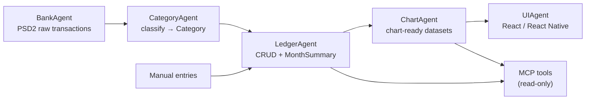
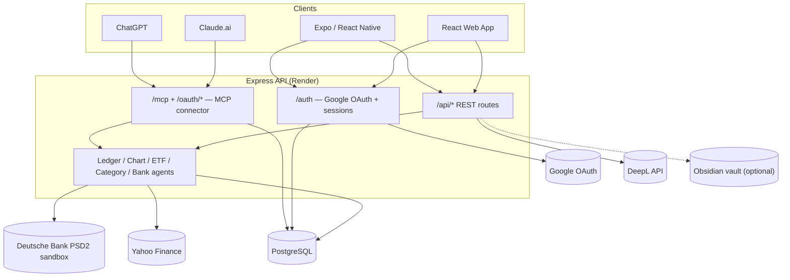
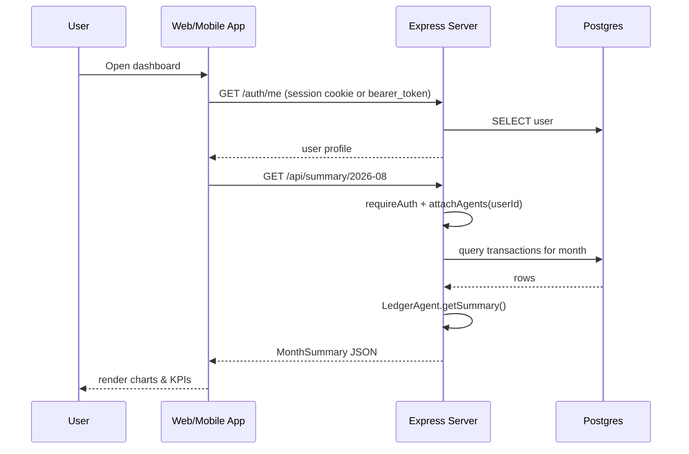
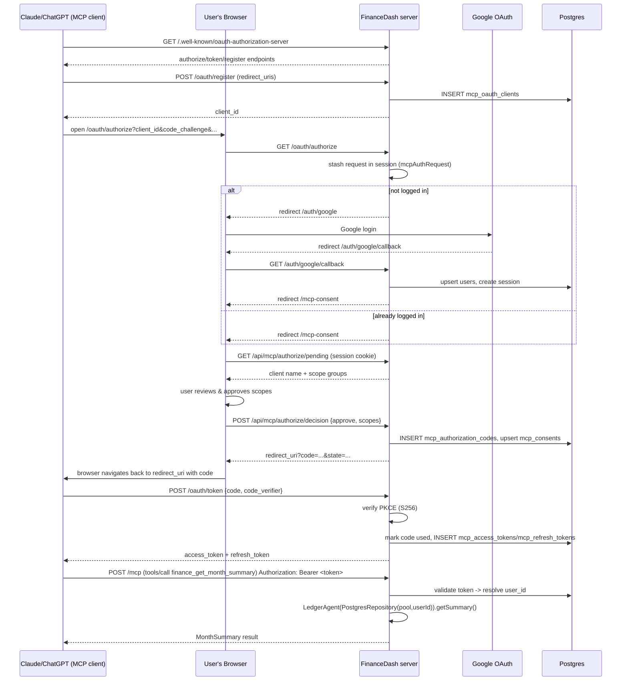

# Personal Dashboard (FinanceDash)

A personal life dashboard: Deutsche Bank PSD2 cash-flow tracking, budgeting and ETF
watchlists, plus daily-life tools (planner, meals, sport, notes, habit chains) — on
web, iOS (Expo), and now as a **remote MCP connector** for Claude and ChatGPT.

## Contents

- [Features](#features)
- [Tech stack](#tech-stack)
- [Architecture](#architecture)
- [System topology](#system-topology)
- [Sequence diagrams](#sequence-diagrams)
- [Project structure](#project-structure)
- [Getting started](#getting-started)
- [MCP connector (Claude / ChatGPT)](#mcp-connector-claude--chatgpt)
- [Developing with Claude Code](#developing-with-claude-code)
- [Roadmap](#roadmap)

## Features

- **Finance** — PSD2 bank sync (Deutsche Bank sandbox), manual entries, categorized
  cash-flow tables, P&L charts, ETF/investment watchlist with live Yahoo Finance data.
- **Life** — daily journal, meal & nutrition log with shopping lists, sport/workout
  tracking with challenges, reminders.
- **Learn** — notes (with an optional Obsidian-vault backend), mindmaps, spaced-repetition
  vocabulary, language sentences/scenarios, and a "Don't break the Chain" habit tracker.
- **MCP connector** — Claude and ChatGPT can connect to your own dashboard as a remote
  tool server, gated behind Google login and an explicit, scoped consent screen.
- Web (React) and iOS (Expo / React Native) clients sharing the same backend and,
  largely, the same business-logic hooks.

## Tech stack

| Layer | Choice |
|---|---|
| Web frontend | React + TypeScript, Tailwind, Recharts |
| Mobile | React Native + Expo |
| Backend | Node.js + Express + TypeScript |
| Database | PostgreSQL |
| Auth | Google OAuth2 (session cookies) + a bearer-token fallback for mobile |
| Bank data | Deutsche Bank PSD2 / XS2A (sandbox simulator) |
| Market data | Yahoo Finance (`yahoo-finance2`) |
| Translation | DeepL API (optional) |
| AI connector | MCP (Model Context Protocol) over Streamable HTTP + OAuth 2.1 |

## Architecture

Financial data flows through a small pipeline of single-responsibility agents
(see `.claude/architecture/*.md` for the full spec of each):



Design rules (enforced across the codebase, see `CLAUDE.md`):

- Manual entries satisfy the same `Transaction` interface as bank-sourced ones.
- Categories and chart types extend via config (`categoryMap.ts`, `CAT_COLORS`), not
  by editing classifier/chart logic.
- Each agent depends on interfaces (`TransactionRepository`), not concrete DB code,
  so a Postgres-backed repo can be swapped for an in-memory one in tests.

## System topology



## Sequence diagrams

### A normal authenticated request (web/mobile client)



### Connecting Claude/ChatGPT via MCP (OAuth + first tool call)



## Project structure

```
src/
├── agents/            # BankAgent, CategoryAgent, LedgerAgent, ChartAgent, ETFAgent
├── mcp/               # MCP OAuth server, auth middleware, and tool definitions
│   ├── oauth/         # PKCE, client registration, auth codes, tokens, consent
│   └── tools/         # finance.ts, investments.ts (read-only tools)
├── api/
│   ├── routes/        # one router per feature area (entries, summary, meal, sport, mcp*, ...)
│   └── obsidian/       # optional vault-file backend for Notes
├── auth/              # passport (Google OAuth) configuration
├── db/                # pool.ts, migrate.ts (single idempotent schema blob)
└── types/             # shared Transaction/MonthSummary types, Express augmentation

client/src/            # React web app (tabs/, components/, hooks/, pages/)
mobile/src/            # Expo / React Native app
.claude/
├── architecture/      # per-agent design docs (BankAgent, LedgerAgent, ChartAgent, ...)
├── agents/            # reviewer sub-agents (e.g. mobile-reviewer.md)
├── tasks/             # backlog.md (planned work) + completed.md (append-only log)
└── settings.json      # hooks wiring (see "Developing with Claude Code" below)
```

## Getting started

**Prerequisites:** Node.js, PostgreSQL running locally, a Google OAuth2 client
(console.cloud.google.com).

```bash
npm install
cp .env.example .env      # fill in DATABASE_URL, SESSION_SECRET, GOOGLE_CLIENT_ID/SECRET
npm run db:migrate        # or just start the server — migrate() runs automatically on boot
npm run dev                # API on :3001, ts-node-dev with hot reload
```

In another terminal, for the web client:

```bash
cd client
npm install
npm run dev                # Vite dev server, proxies /api and /auth to :3001
```

Key environment variables (see `.env.example` for the full list):

| Var | Purpose |
|---|---|
| `DATABASE_URL` | Postgres connection string |
| `SESSION_SECRET` | express-session cookie signing secret |
| `GOOGLE_CLIENT_ID` / `GOOGLE_CLIENT_SECRET` | Google OAuth2 credentials |
| `API_URL` | Public origin of the server — also used as the MCP OAuth issuer/resource base |
| `DB_CLIENT_ID` / `DB_CLIENT_SECRET` / `DB_REDIRECT_URI` / `DB_API_BASE` | Deutsche Bank PSD2 sandbox |
| `DEEPL_API_KEY` | Optional, enables in-app translation |
| `OBSIDIAN_VAULT_PATH` | Optional, stores Notes as markdown files in an Obsidian vault instead of Postgres |

No demo credentials needed to explore the app locally: visiting `/auth/demo` auto-seeds
a demo user and logs you in without going through Google.

## MCP connector (Claude / ChatGPT)

FinanceDash exposes itself as a remote **MCP server** at `/mcp`, so Claude or ChatGPT
can read (currently read-only) your finance data as tools in a normal chat. See the
[sequence diagram above](#connecting-claudechatgpt-via-mcp-oauth--first-tool-call) for
exactly what happens under the hood — connecting always goes through your existing
Google login plus an explicit consent screen that lists what's being shared.

### Try it with Claude (claude.ai)

1. Make sure your server is deployed and reachable over HTTPS (Render, etc.) — the local
   dev server also works if you connect via a tunnel, but `localhost` alone is not reachable
   from claude.ai's servers.
2. In Claude.ai, go to **Settings → Connectors → Add custom connector**.
3. Enter your server's MCP URL: `https://<your-domain>/mcp`.
4. Claude will register itself as an OAuth client, then open a browser tab that:
   - Logs you into FinanceDash with Google (if you aren't already logged in).
   - Shows the **consent screen** — review which scope groups (e.g. "Finance & Investments:
     read-only") you're granting, then click **Allow**.
5. You're redirected back to Claude, and the connector shows as connected. Try asking:
   > "What's my spending summary for this month?"
   > "What does my ETF watchlist look like right now?"

### Try it with ChatGPT

1. Enable **Developer Mode** in ChatGPT settings (required for custom MCP connectors).
2. Add a custom connector with the same URL: `https://<your-domain>/mcp`.
3. Complete the same Google-login + consent flow as above.
4. Ask ChatGPT the same kind of question — it will call the same read-only tools.

### What's exposed right now

Only the `finance:read` scope exists today — **read-only**, and deliberately narrow:

- Month summaries, transaction lists, top payees, category breakdown, balance trend,
  income vs. expense (all from the existing `LedgerAgent`/`ChartAgent`).
- ETF watchlist prices/performance and YTD investment contributions — amounts only,
  no merchant names, no per-holding composition, no bank-connection status (see the
  roadmap below for why).

There is no way to create, edit, or delete anything through the connector yet, and
your journal is never exposed. You can review/revoke what's connected from the
`mcp_consents`/`mcp_access_tokens` tables today; a UI for this is on the roadmap.

## Developing with Claude Code

This repo is actively developed with Claude Code, using the conventions in `CLAUDE.md`:

**Sub-agents** (spawned inline via the `Agent` tool after each completed task):

| Agent | Spec | Purpose |
|---|---|---|
| CommitAgent | `.claude/architecture/commit-agent.md` | Writes the commit message and commits (`model: haiku`) |
| TaskLoggerAgent | `.claude/architecture/task-logger-agent.md` | Appends a structured entry to `.claude/tasks/completed.md` |
| mobile-reviewer | `.claude/agents/mobile-reviewer.md` | Reviews changed `.tsx` files for touch targets, dark mode, responsive layout |

**Hooks** (`.claude/settings.json`, implemented in `hooks/`):

| Event | What it does |
|---|---|
| `PreToolUse` (Read) | Caps unbounded file reads to 200 lines if a file is over 50KB |
| `PostToolUse` (all) | Logs tool usage/telemetry, compresses large (>20KB) tool outputs into a preview, tracks edited `.tsx` files for the mobile-review trigger |
| `SessionStart` | Records the starting git SHA, resets the session's edited-`.tsx` log |
| `Stop` | Fires the mobile-reviewer if `.tsx` files changed this session; syncs any `[DONE]` backlog tasks into `completed.md` |

**Task tracking** (`.claude/tasks/`): `backlog.md` holds not-yet-started work as
`## TASK-NNN` sections; `completed.md` is an append-only log written by TaskLoggerAgent
(and by the `Stop` hook as a session-summary fallback). Mark a backlog task `[DONE]` in
its heading and the `Stop` hook moves it to `completed.md` automatically.

Design plans for larger features (like the MCP connector) are written to
`~/.claude/plans/*.md` before implementation and kept up to date as phases complete.

## Roadmap

**MCP connector** (this is being built incrementally — see the plan file used during
development for full detail):

- [x] Phase 1 — OAuth 2.1 authorization server (dynamic client registration, PKCE,
      RFC 8414/9728 discovery), reusing the existing Google login
- [x] Phase 2 — `/mcp` Streamable HTTP endpoint + read-only Finance/Investments tools
- [ ] Phase 3 — Notes tools (read + write)
- [ ] Phase 4 — Reminders tools (read + write)
- [ ] Phase 5 — Meal tools (Foods/Logs/Shopping; recipes need a server-side home first —
      they're currently browser-`localStorage`-only)
- [ ] Phase 6 — Sport tools (exercises, templates, logs, targets, challenges, weight, schedule)
- [ ] Phase 7 — Production deploy + register the connector in Claude.ai and ChatGPT,
      end-to-end verification; stretch: a "Connected Apps" panel to view/revoke access

**Product backlog** (see `.claude/tasks/backlog.md` for the live, up-to-date list):

- AI-assisted transaction categorization (LLM-suggested categories on import, with a
  "correct this" feedback loop)
- Full PSD2 / Deutsche Bank OAuth2 integration against the production API (currently
  sandbox/simulator)
- Recurring-template automation (auto-generate transactions from active templates)
- Grocery receipt upload with OCR (Lidl/Aldi/Kaufland/Rewe) into shopping lists or food logs
- Per-user DeepL API keys, once multi-user usage warrants it
- Continued React Native / Expo parity with the web app
